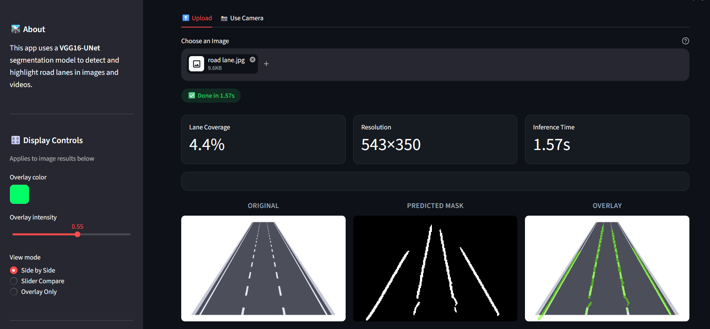

# 🛣️ Road Lane Segmentation using VGG16-UNet

An end-to-end Deep Learning application for **Road Lane Segmentation** built using a **VGG16-UNet** architecture and deployed with **Streamlit**. The application allows users to upload **images** or **videos** and generates accurate lane segmentation overlays for autonomous driving and intelligent transportation applications.

---

## 📌 Project Overview

Road lane detection is a fundamental task in autonomous driving systems and Advanced Driver Assistance Systems (ADAS). This project performs **semantic segmentation** of road lanes using a pretrained VGG16 encoder integrated with a U-Net decoder.

---

## 🚀 Demo

### Input

- Road Images
- Driving Videos

### Output
- Binary Lane Mask
- Lane Overlay on Original Image
- 

- Processed Video with Lane Segmentation
- 

---

## 🏗️ Project Architecture

```
                User Upload
                     │
        ┌────────────┴────────────┐
        │                         │
      Image                    Video
        │                         │
        └────────────┬────────────┘
                     │
             Streamlit Web App
                     │
             Image Preprocessing
                     │
          VGG16-UNet Segmentation Model
                     │
            Binary Lane Prediction
                     │
          Overlay Generation (OpenCV)
                     │
             Display & Download
```

---

# 📂 Project Structure

```
LaneSegmentation/
│
├── app.py                  
├── model.py                 
├── image_predict.py            
├── video_predict.py         
│
├── models/
│      best_model.keras
│
├── uploads/
├── outputs/
├── notebooks/
│      road-lane-segmentation-vggunet-tusimple.ipynb
│
├── requirements.txt
└── README.md
```

---

# 🧠 Model Architecture

- Encoder: **Pretrained VGG16**
- Decoder: **UNet Decoder**
- Loss Function: Dice Loss
- Optimizer: Adam
- Output: Binary Lane Segmentation Mask

---

# 📊 Dataset

Dataset Used:

**TuSimple Lane Detection Dataset**

The dataset consists of:

- Road Images
- Lane Coordinate Annotations
- JSON Label Files

The annotations are converted into binary segmentation masks before training.

---

# 📈 Workflow

```
Input Image / Video

↓

Preprocessing

↓

Resize (224×224)

↓

Normalization

↓

VGG16 Encoder

↓

UNet Decoder

↓

Binary Lane Mask

↓

Overlay Generation

↓

Display Results
```

---

# 📊 Future Improvements

- Live Webcam Lane Detection
- Cloud Deployment (AWS / Azure / GCP)
- Multi-class Lane Segmentation
- Real-time FPS Optimization
- Lane Departure Warning System
- Distance Estimation
- Support for HD Videos

---

# 🎯 Applications

- Autonomous Vehicles
- Advanced Driver Assistance Systems (ADAS)
- Smart Transportation
- Road Infrastructure Monitoring
- Driver Assistance Systems
- Intelligent Mobility

---

# 📜 License

This project is licensed under the MIT License.

---

# 👨‍💻 Author

**Satyam Chaurasiya**

Machine Learning | Deep Learning | Computer Vision | AI

